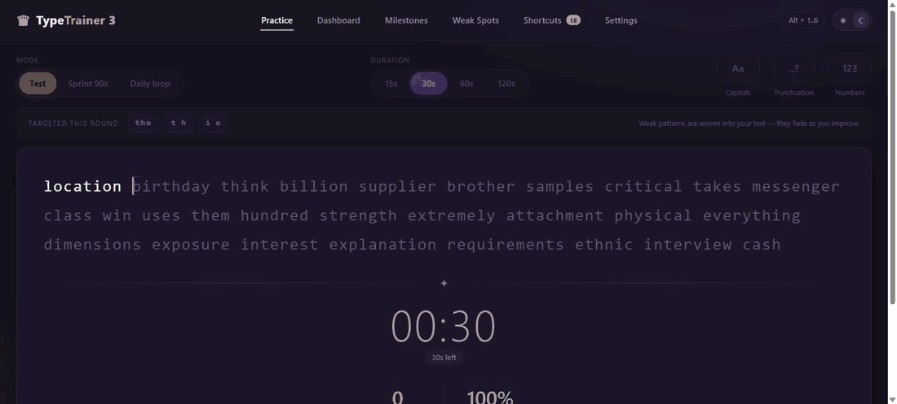
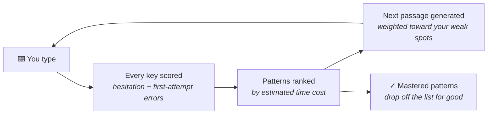
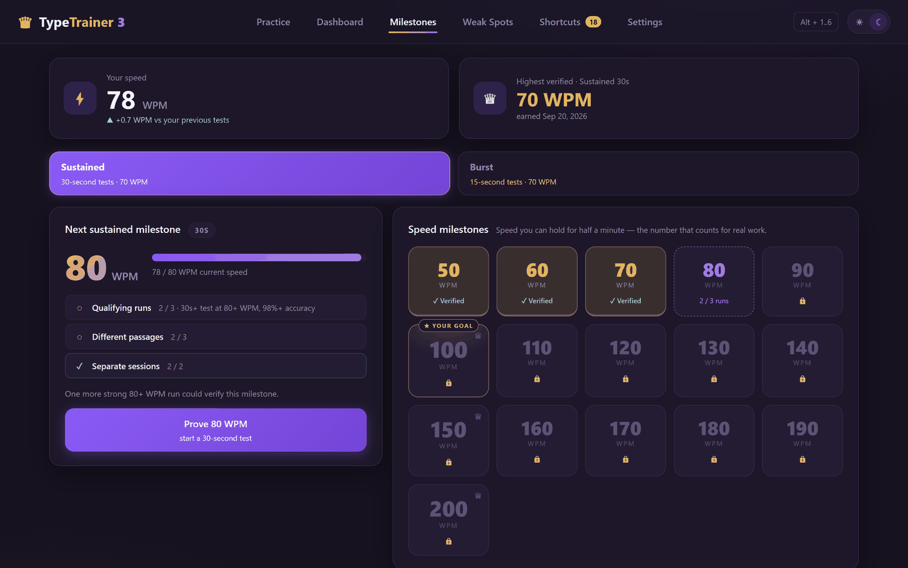
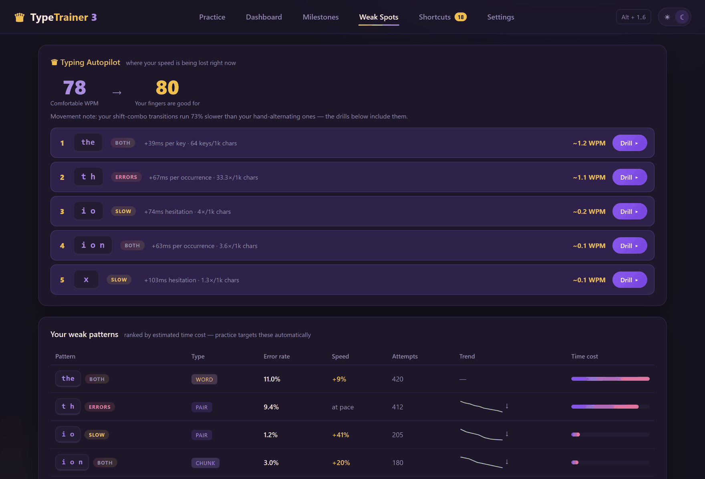
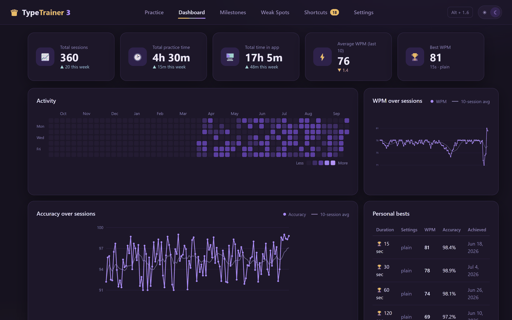
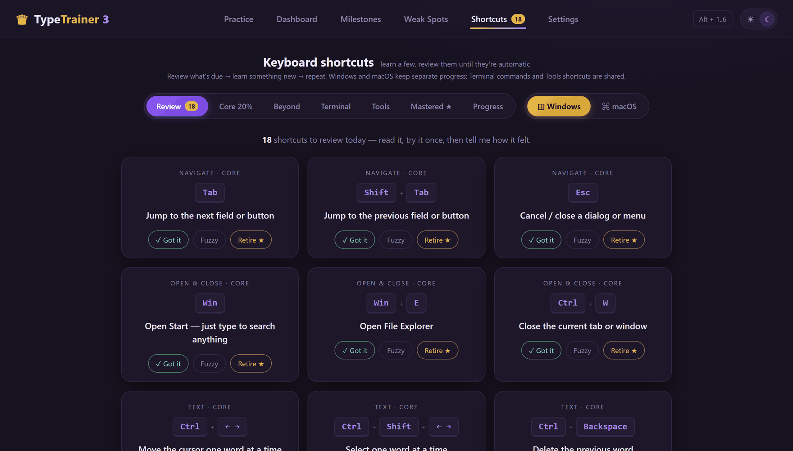

<div align="center">

# 👑 TypeTrainer

### A touch-typing trainer that studies your mistakes and builds your practice text out of them.

**Offline · no account · no tracking · no dependencies · no build step**



</div>

---

## The idea

Most typing sites hand you random words and a score at the end. You get a little faster at the words they happened to pick, and you keep every finger habit that was actually costing you time.

**TypeTrainer works the other way around.** Every keystroke you make is scored — how long your finger hesitated, and whether you got it right the *first* time. Those scores build a picture of which letters, letter pairs, chunks and whole words are slowing you down, and the next passage you type is quietly woven out of exactly those.

Practise the things you are bad at, and only for as long as you are still bad at them.



The app tells you which patterns it is targeting before every round, and shows you the moment one improves:

> `th` improved from 22.0% → 8.1% error rate ↓

---

## How weakness is measured

A mistake is not automatically your biggest problem. Fumbling `x` costs you almost nothing, because you barely type it. A 40 ms hesitation on `the` costs you real minutes a day.

So every pattern is scored in the only unit that matters — **estimated time lost**:

```
weakness  =  ( excess latency vs. your own baseline  +  error cost )
             ×  how often it appears in real English
             ×  confidence (how many times you have attempted it)
             ×  recency
```

Three consequences worth knowing:

- **Your baseline is your own.** Hesitation is measured against how fast *you* type comparable movements, not against some global average — so the app doesn't just tell you that same-finger rolls are hard for everyone.
- **Frequency decides the ranking.** A rare letter you botch constantly will sit below a common pair you are merely slightly slow on, because that is where the seconds actually are.
- **Mastery has to be earned and it sticks.** A pattern leaves the weak list only when it is accurate *and* at pace (within 1.25× your baseline) *and* consistent, with hysteresis so it can't flicker in and out. Mastered patterns stop being targeted.

### What gets tracked

| Level | Examples | Why |
|---|---|---|
| Single characters | `x` · `p` | the raw finger movement |
| Pairs | `th` · `er` · `io` | most of typing is bigram transitions |
| Chunks | `ion` · `her` | trigrams you should hit as one motion |
| Whole words | `the` · `that` | common words should be one reflex, not five keystrokes |
| Transition classes | same-finger · shift combos · hand alternation | finds *mechanical* problems, e.g. "your shift-combo transitions run 73% slower than your hand-alternating ones" |

A full QWERTY hand/finger model backs this, so the app can tell a motor slip apart from a transposition and diagnose the movement, not just the letter.

---

## Practice modes

| Mode | What it is |
|---|---|
| **Test** | 15 / 30 / 60 / 120 seconds. The only mode that sets personal bests and earns badges. |
| **Sprint 90s** | One weak pattern, drilled up a ladder: isolate it → chunks → words → natural text. |
| **Daily loop** | 4–15 minutes, split into one-minute parts (Warm-up → Transitions → Chunks → Natural → Cool-down) with a checkpoint between each, so a long session doesn't have to be one unbroken sitting. |

Sprints pick their own target with a **stick-then-rotate** rule: it stays on the same pattern until you genuinely improve on it, then rotates the *kind* of target — letter → pair → chunk → word — so you never spend a week on single letters. A pattern that stops improving for days gets parked for a while instead of ground into the floor.

---

## Verified speed badges



Hitting 90 WPM once, on a lucky passage, does not mean you type at 90 WPM. A badge here means the app has **evidence** that you can hold a speed:

- **3 qualifying runs** at the threshold with **≥98% accuracy**
- across **3 different passages** (so it isn't one memorised paragraph)
- spread over **at least 2 separate sessions** (so it isn't one hot streak)

Two independent tracks run side by side — **Sustained** (30-second tests) and **Burst** (15-second tests) — each with its own goal, from 50 up to 200 WPM in steps of 10. The Milestones tab shows exactly which of the three conditions you are still missing, and a fast run cascades down to award every lower badge at once.

---

## Also in the box



**Weak Spots** — *Typing Autopilot* estimates the WPM you are comfortable at versus the WPM your fingers are already good for, then lists exactly where the gap is going, in WPM, with a Drill button on each row. Underneath: the full ranked pattern table with error rate, pace, attempt count and trend, and a *Recently mastered* shelf for the ones that no longer need you.

**Dashboard** — activity heatmap, WPM and accuracy over sessions with rolling averages, personal bests per duration, and practice time tracked separately from total time in the app.



**Shortcuts** — a spaced-repetition trainer for the keys you *don't* practise by typing prose: 91 Windows and 75 macOS system shortcuts, 106 Linux terminal commands (with a type-it-back box), and 118 VS Code and Claude Code shortcuts. Cards come back on a review schedule until they are automatic.



**Three themes** — dark, dim (twilight violet) and light, toggled from the header.

---

## Run it

There is no build step and nothing to install. Clone it and open the file:

```bash
git clone https://github.com/Cha-Imaa/typetrainer.git
cd typetrainer
```

Then either **double-click `index.html`** — that is genuinely all it takes — or serve it if you prefer working DevTools:

```bash
python -m http.server 8125     # then open http://localhost:8125
```

> **Note:** the two are different browser origins, so progress saved from `file://` will not show up on `localhost` and vice versa. Pick one and stick with it. On Windows, `start.bat` does the server-and-open in one double-click.

### Useful URL parameters

| Parameter | Effect |
|---|---|
| `?demo=1` | fills the app with realistic sample data, **in memory only** — nothing is saved |
| `?tab=dashboard` | open straight to a tab (`practice`, `dashboard`, `milestones`, `weakspots`, `shortcuts`, `settings`) |
| `?theme=light` | force a theme (`dark`, `dim`, `light`) |

---

## Tests

403 assertions across three suites — no fixtures, no mocking framework, just Node and a headless Chrome:

```bash
node tests/test_engine.js    # 171 — adaptive engine, weakness scoring, drills, sprint rotation
node tests/test_badges.js    #  79 — badge qualification rules and evidence tracking
cd tests && npm install      # puppeteer-core, only needed for the UI suite
node tests/test_ui.js        # 153 — drives the real app in headless Chrome over file://
```

The UI suite needs to find Chrome; it defaults to the standard Windows install path, and you can point it anywhere with `CHROME=/path/to/chrome node tests/test_ui.js`.

---

## How it is built

Vanilla JavaScript on a global `TT` namespace, loaded with classic `<script>` tags — deliberately, so that opening `index.html` straight off the disk works with no server and no bundler. Nothing is fetched from the network at any point.

```
index.html          the whole UI
css/style.css       one stylesheet, three themes
js/
  stats.js          the adaptive engine — per-pattern EMAs, weakness scoring, mastery
  fingermap.js      QWERTY hand/finger model and transition classes
  generator.js      weakness-weighted sampling from a 4,000-word frequency list
  practice.js       the typing surface and first-attempt error latching
  drills.js         sprint ladders and the daily-loop structure
  stall.js          sprint target selection, improvement detection, parking
  badges.js         verified-speed-badge rules (both tracks)
  storage.js        localStorage schema and migrations
  …                 dashboard, milestones, weakspots, charts, heatmap, shortcuts, settings
docs/
  verified-speed-badges.md    the design spec the badge system was built from
tests/              three suites, 403 assertions
```
